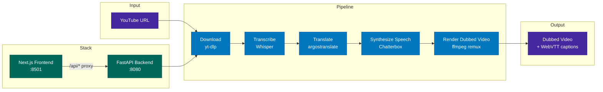

# Foreign Whispers

[](./LICENSE)

YouTube video dubbing pipeline — transcribe, translate, and dub 60 Minutes interviews into a target language.

## Architecture



## Quick Start

### Prerequisites

- Docker & Docker Compose
- ~5 GB free disk for model caches on first boot

### 1. Clone and create the optional cookies placeholder

```bash
git clone <repo-url> foreign-whispers
cd foreign-whispers
touch cookies.txt   # placeholder for optional yt-dlp YouTube auth — leave empty if not needed
```

`cookies.txt` is bind-mounted into the API container. Docker silently creates a *directory* with that name if the file is missing, which breaks yt-dlp — so always run `touch cookies.txt` on a fresh clone. If you need to download age- or region-restricted videos, replace it with a real Netscape-format cookies file.

### 2. Boot the stack

Pick the profile that matches your hardware. Both bundle Whisper STT and Chatterbox TTS — there is **no external setup**.

**Linux + NVIDIA GPU** (Whisper + Chatterbox on CUDA, ~real-time TTS):

```bash
docker compose --profile nvidia up -d
```

**Apple Silicon Mac or any CPU-only host** (multi-arch CPU images, voice cloning still works, but TTS is ~30-50× slower):

```bash
docker compose --profile cpu up -d
```

First boot downloads model weights into named volumes (~2 GB Whisper, ~1.5 GB Chatterbox). Subsequent boots are instant.

### 3. Open the app

Browse to <http://localhost:8501>.

The catalog ships with two pre-dubbed sample videos (*Strait of Hormuz disruption*, *Alysa Liu: The 60 Minutes Interview*) so you can verify the stack is healthy without waiting for synthesis. Click one — the dubbed audio and translated captions should play immediately.

### 4. Submit a new YouTube URL

The video catalog is driven by [`video_registry.yml`](video_registry.yml). Add an entry:

```yaml
- id: <youtube-video-id>
  title: A Human-Readable Title
  url: https://www.youtube.com/watch?v=<youtube-video-id>
```

Reload the API so it picks up the new entry:

```bash
docker compose --profile <nvidia|cpu> restart api
```

Refresh the frontend — your new video appears in the sidebar. Click through the pipeline buttons (Download → Transcribe → Translate → TTS → Stitch) to dub it.

## Profile comparison

|                          | `nvidia`                              | `cpu`                                                      |
| ------------------------ | ------------------------------------- | ---------------------------------------------------------- |
| Whisper image            | `speaches:*-cuda-12.6.3`              | `speaches:*-cpu` (multi-arch, incl. arm64)                 |
| TTS image                | `travisvn/chatterbox-tts-api:latest`  | `travisvn/chatterbox-tts-api:cpu` (multi-arch)             |
| Voice cloning            | ✅ via `/v1/audio/speech/upload`       | ✅ same endpoint                                            |
| TTS latency / segment    | ~1 s                                  | ~30–50 s on Apple Silicon                                  |
| End-to-end dub of a 7-min video | ~3–5 min                       | ~30–45 min                                                 |

If you're on a Mac and want faster TTS without GPU, see [`notebooks/tts_integration/chatterbox_colab_remote.ipynb`](notebooks/tts_integration/chatterbox_colab_remote.ipynb). It boots Chatterbox on a free Colab GPU and exposes it through a Cloudflare tunnel; on the Mac, set `CHATTERBOX_API_URL=<tunnel-url>` in `.env` and recreate the api container.

## Pipeline Stages

| Stage                    | What it does                                                            | Output                       |
| ------------------------ | ----------------------------------------------------------------------- | ---------------------------- |
| **Download**             | Fetch video + captions from YouTube via yt-dlp                          | `videos/`, `youtube_captions/` |
| **Transcribe**           | Speech-to-text via Whisper                                              | `transcriptions/whisper/`    |
| **Translate**            | Source → target language via argostranslate (offline, OpenNMT)          | `translations/argos/`        |
| **Synthesize Speech**    | TTS via Chatterbox, time-aligned and voice-cloned per segment           | `tts_audio/chatterbox/`      |
| **Render Dubbed Video**  | Replace audio track via ffmpeg remux (no re-encoding)                   | `dubbed_videos/`             |

Captions are served as WebVTT via the `<track>` element — no subtitle burn-in:

| Endpoint                              | Source                                  | Output                  |
| ------------------------------------- | --------------------------------------- | ----------------------- |
| `GET /api/captions/{id}/original`     | YouTube captions (generated on the fly) | —                       |
| `GET /api/captions/{id}`              | Translated segments + YouTube offset    | `dubbed_captions/*.vtt` |

## API Endpoints

| Method | Endpoint                       | Description                                  |
| ------ | ------------------------------ | -------------------------------------------- |
| POST   | `/api/download`                | Download YouTube video + captions            |
| POST   | `/api/transcribe/{id}`         | Whisper speech-to-text                       |
| POST   | `/api/translate/{id}`          | Source → target language translation         |
| POST   | `/api/tts/{id}`                | Time-aligned TTS synthesis                   |
| POST   | `/api/stitch/{id}`             | Audio remux (`ffmpeg -c:v copy`)             |
| GET    | `/api/video/{id}`              | Stream dubbed video (range requests)         |
| GET    | `/api/video/{id}/original`     | Stream original video                        |
| GET    | `/api/captions/{id}`           | Translated WebVTT captions                   |
| GET    | `/api/captions/{id}/original`  | Original-language WebVTT captions            |
| GET    | `/api/audio/{id}`              | TTS audio (WAV)                              |
| GET    | `/healthz`                     | Health check                                 |

## Project Structure

```text
foreign-whispers/
├── api/src/                     # FastAPI backend (layered architecture)
│   ├── main.py                  # App factory + lazy model loading
│   ├── core/config.py           # Pydantic settings (FW_ env prefix)
│   ├── routers/                 # Thin route handlers
│   │   ├── download.py          # POST /api/download
│   │   ├── transcribe.py        # POST /api/transcribe/{id}
│   │   ├── translate.py         # POST /api/translate/{id}
│   │   ├── tts.py               # POST /api/tts/{id}
│   │   └── stitch.py            # POST /api/stitch/{id}, GET /api/video/*, /api/captions/*
│   ├── services/                # Business logic (HTTP-agnostic)
│   ├── schemas/                 # Pydantic request/response models
│   └── inference/               # ML model backend abstraction
├── foreign_whispers/            # Pure-Python alignment / evaluation library
├── frontend/                    # Next.js + shadcn/ui
├── pipeline_data/               # Bind-mounted runtime artifacts
│   └── api/
│       ├── videos/                  # Source MP4s
│       ├── youtube_captions/        # yt-dlp caption JSON
│       ├── transcriptions/whisper/  # Whisper output JSON
│       ├── translations/argos/      # argostranslate output JSON
│       ├── tts_audio/chatterbox/    # TTS WAV per config
│       ├── dubbed_captions/         # Target-language VTT
│       └── dubbed_videos/           # Final dubbed MP4 per config
├── video_registry.yml           # Single source of truth for the video catalog
├── docker-compose.yml           # Profiles: nvidia, cpu
└── Dockerfile                   # API container (Python 3.11 slim + uv)
```

## Container layout

```text
Host machine
├── foreign_whispers/      ← bind-mounted into API container
├── api/                   ← bind-mounted into API container
├── pipeline_data/         ← bind-mounted into API container
│
└── Docker Compose
    ├── foreign-whispers-stt        :8000  — Whisper inference
    ├── foreign-whispers-tts        :8020  — Chatterbox inference
    ├── foreign-whispers-api        :8080  — FastAPI orchestrator (CPU only — delegates STT/TTS via HTTP)
    └── foreign-whispers-frontend   :8501  — Next.js UI
```

The API container is CPU-only — it delegates all heavy work to the STT/TTS containers via HTTP. `foreign_whispers/` and `api/` are bind-mounted from the host so source edits don't require an image rebuild — just `restart api`.

## Development

### Editing source

1. Start the stack: `docker compose --profile <nvidia|cpu> up -d`
2. Edit any file in `foreign_whispers/` or `api/`.
3. Pick up changes:

   ```bash
   docker compose --profile <nvidia|cpu> restart api
   ```

   Or add `--reload` to the uvicorn command in [`docker-compose.yml`](docker-compose.yml) for hot reload during development.

### Working on the alignment library directly (no Docker)

```bash
uv sync
uv run python -c "from foreign_whispers import global_align, compute_segment_metrics; print('ok')"
```

For Jupyter / VS Code notebooks:

```bash
uv pip install ipykernel
uv run python -m ipykernel install --user --name foreign-whispers
```

Then select the **foreign-whispers** kernel in the kernel picker.

### When to rebuild

| Change                                  | Action needed                                                                   |
| --------------------------------------- | ------------------------------------------------------------------------------- |
| Edit `foreign_whispers/*` or `api/**/*` | `docker compose --profile <p> restart api` (or use `--reload`)                  |
| Edit `pyproject.toml` / add deps        | `docker compose --profile <p> build api && docker compose --profile <p> up -d api` |
| Edit `frontend/`                        | Frontend runs in dev mode with hot reload — no action needed                    |
| Edit `docker-compose.yml`               | `docker compose --profile <p> up -d` (re-creates changed services)              |

### Optional: HuggingFace token for diarization

The pyannote speaker-diarization step is **optional**. If you want speaker-aware voice cloning, set `FW_HF_TOKEN` in `.env` (after accepting the pyannote model EULA on huggingface.co). Without it the diarize step returns an empty speaker list and TTS uses a single default voice — the rest of the pipeline still works.

## Requirements

- Python 3.11 (only needed if running notebooks / library outside Docker)
- ffmpeg (system-wide, only needed for non-Docker workflows)
- For the `nvidia` profile: NVIDIA drivers + the NVIDIA Container Toolkit

## Demo videos

Sample input, output, and an app screen recording are hosted on Google Drive:

**[Foreign Whispers Submission Folder](https://drive.google.com/drive/folders/1kltFc07M1IHnGhsFtW_UM5Di9xIfIg8m?usp=sharing)**

The folder contains:
- `sample_input.mp4` — original English YouTube video (60 Minutes segment on the Strait of Hormuz)
- A Spanish-dubbed output produced by the aligned pipeline with per-speaker voice cloning (chatterbox-multilingual conditioned on three speaker reference WAVs derived from pyannote diarization) and Spanish subtitles burned into the video for legibility
- A screen recording of the Dubbing Studio frontend running the full pipeline end-to-end

The pipeline runs through the Dubbing Studio frontend at http://localhost:8501 against the Docker stack (`docker compose --profile nvidia up -d`, or `--profile cpu` on Apple Silicon).

### Reproducibility notes

- **YouTube downloads.** `get_video_info` checks `video_registry.yml` first and falls back to `yt-dlp` only for unregistered URLs. On networks where YouTube triggers its bot-check (datacenter IPs, some VPNs), use the registered videos in the catalog or place the MP4 manually in `pipeline_data/api/videos/<title>.mp4` to bypass the live download.
- **Speaker reference WAVs.** Chatterbox-multilingual's reference encoder requires 24 kHz mono. Reference WAVs at other rates fail with opaque tensor errors inside the model. The reference WAVs in `pipeline_data/speakers/` ship at 24 kHz.
- **TTS concurrency.** Chatterbox-multilingual's inference state is not thread-safe under concurrent `/v1/audio/speech/upload` calls. Set `FW_TTS_WORKERS=1` for the api container to force serial synthesis. The default in `docker-compose.yml` reflects this.

## Architecture report

A 5-6 page architecture report covering pipeline design, voice cloning per speaker, the project journey across three reproducibility pivots, the upstream chatterbox-multilingual issues diagnosed during development, and lessons learned is at [`report/foreign_whispers_report.docx`](report/foreign_whispers_report.docx).
